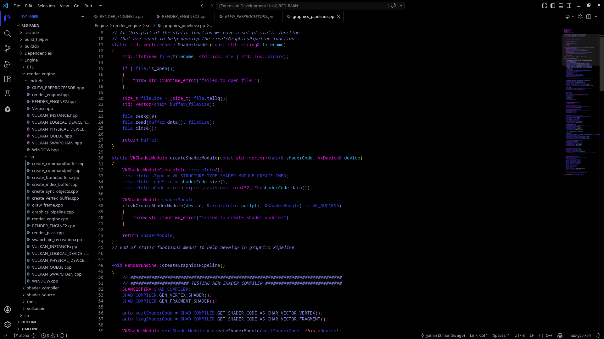
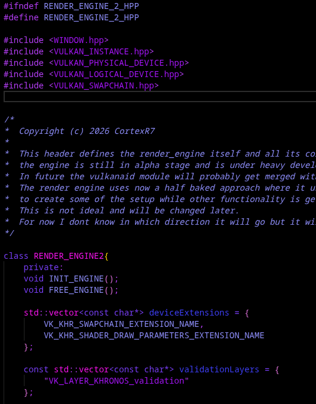

# AlphaCode
A high contrast C/C++ color theme for Visual Studio Code — deep blacks, vivid pinks, blues, and purples.




---

## About
AlphaCode is built primarily for **C and C++ developers** who want a visually sharp, high contrast coding environment. The palette combines electric blues, pinks, and purples on a pure black background to make every token pop.

Still in alpha — further development and refinements coming.

---

## Color Palette
| Role | Color |
|---|---|
| Background | `#000000` |
| Foreground | `#bdb5c8` |
| Keywords | `#783BF5` |
| Functions | `#8C8CF5` |
| Strings | `#A40CF5` |
| Variables | `#3B3CF5` |
| Numbers / Constants | `#3BB0F5` |
| Comments | `#8C8CF5` italic |
| Classes / Types | `#F50AEC` |
| Operators / Punctuation | `#B53BF5` |

---

## Installation
Search for **AlphaCode** in the VS Code Extensions panel or install via the command line:
```bash
ext install CortexR7.alphacode
```

---

## What's New in 0.0.6
- Improved autocomplete suggestion widget: the active suggestion is now clearly distinguishable for better visual clarity
- Default foreground color updated to `#bdb5c8` for a softer, more readable baseline

---

## License
[View License](LICENSE)